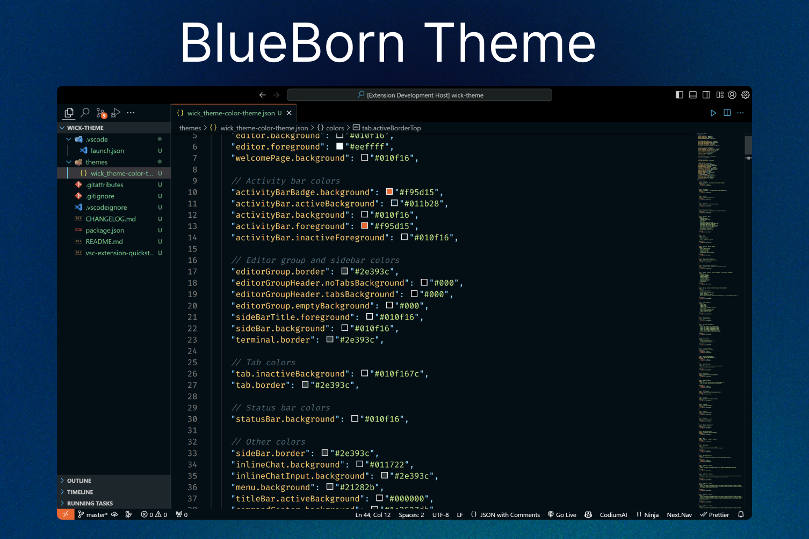
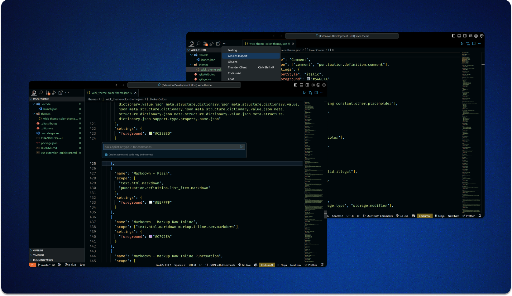

# BlueBorn

Blueborn is a vibrant and soothing theme designed for Visual Studio Code, offering a refreshing blue-toned color palette that enhances your coding experience.

## Installation

You can install the Blueborn theme through the **Extensions** view in VS Code. Search for "Blueborn" and click **Install**.

## Features

- **Pleasant Color Scheme:** Enjoy a calming and easy-on-the-eyes blue-themed color palette.
- **Improved Readability:** Carefully selected colors for enhanced readability of your code.
- **Custom Syntax Highlighting:** Highlights syntax elements to make your code more distinguishable.

## How to Use

1. Launch Visual Studio Code.
2. Go to **Extensions** (Ctrl+Shift+X).
3. Search for "Blueborn" and click **Install**.
4. Press `Ctrl+Shift+P` to open the command palette.
5. Select "Preferences: Color Theme" and choose "Blueborn" from the list.

## Feedback

Your feedback is essential to improve the Blueborn theme! Feel free to [open an issue](https://github.com/KarthikeyaEnge/BlueBorn/issues) for any suggestions, feedback, or bug reports.

## Screenshots

## Contributing

Contributions are welcome! If you'd like to contribute to this theme, please follow the contribution guidelines.

## License

This theme is licensed under the [MIT License](https://github.com/KarthikeyaEnge/BlueBorn/blob/main/LICENSE).

---

**Enjoy coding with the Blueborn theme!**
